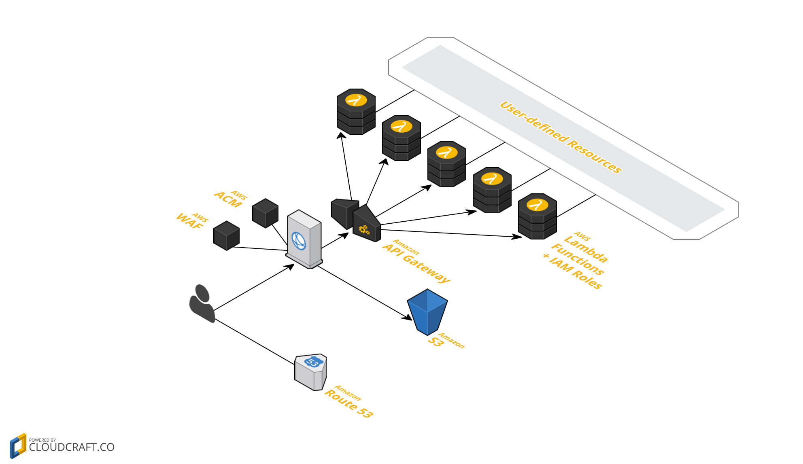

# dawson

[]() 
[](https://travis-ci.org/dawson-org/dawson-cli) 
[](https://www.codacy.com/app/simone_3096/dawson?utm_source=github.com&amp;utm_medium=referral&amp;utm_content=lusentis/dawson&amp;utm_campaign=Badge_Grade) 
[]() 
[]() 
[](https://github.com/Flet/semistandard) 

A [serverless](https://auth0.com/blog/what-is-serverless/) web framework for Node.js on AWS ([CloudFormation](https://aws.amazon.com/cloudformation/), [API Gateway](https://aws.amazon.com/apigateway/), [Lambda](https://aws.amazon.com/lambda/)).  
You can use `dawson` to build and deploy *Single Page Apps + API*, *pure APIs* or *server-rendered pages*.

```js
// api.js
module.exports.greet = function greet (event) {
    const name = event.params.path.name
    return 'Hello ' + naem + ', you look awesome!'
}
greet.api = {
    path: 'greet/{name}'
}
```
```bash
$ dawson deploy
```

## Documentation
Guide, API & CLI Documentation is [here](docs/README.md).


## About
`dawson` lets you to deploy your Node.js apps on Amazon Web Services. It requires **no boilerplate**: no `init` command, no configuration files. Just write your functions and `deploy`!

You can write your functions in ES2016, ES2017, using async-await or using experimental features, like you whish. Just include a `.babelrc` and `dawson` will **compile** your code with [babel](https://babeljs.io) before deploying it. Your Lambda functions can be **`async`** and return **Promises**. There's also **built-in authentication support** via [API Gateway Custom Authorizers](https://docs.aws.amazon.com/apigateway/latest/developerguide/use-custom-authorizer.html).

Each function has its **own IAM Role**, so you can define [fine-graned IAM Policies](https://docs.aws.amazon.com/IAM/latest/UserGuide/best-practices.html#grant-least-privilege).  
`dawson` offers first-class support for **Single Page Applications**: a **CloudFront** Distribution will be deployed in front of your app, correctly mapping assets and the API origin, so you don't have to worry about CORS. An [AWS WAF](https://aws.amazon.com/waf/) WebACL can also be attached to CloudFront.

`dawson` **does not bundle** your app with webpack, browserify or rollup, so you'll never have to deal [with](https://github.com/aws/aws-sdk-js/issues/603) [weird](https://github.com/substack/brfs) [things](https://stackoverflow.com/questions/32253362/how-do-i-build-a-single-js-file-for-aws-lambda-nodejs-runtime). Your app's `devDependencies` are stripped out while deploying, keeping the bundle ZIP small.

`dawson` uses **pure CloudFormation templates**, following the [infrastructure-as-code](https://en.wikipedia.org/wiki/Infrastructure_as_Code) principle; it requires **no local or remote state files** which may go out-of-sync or mistakenly be deleted. You can **customize your app's template** in every part, e.g.: you can add CloudFormation Resources, modify Properties of Resources created by `dawson` etc. As a free benefit, you get out-of-the-box support for **multiple stages and regions**.

Finally, `dawson` will automatically **support HTTPS** for custom domains thanks to [AWS ACM](https://aws.amazon.com/acm/). Also, if you use [Route53](https://aws.amazon.com/route53/) your **DNS Zone** can be automatically updated.

#### CLI
Using the `dawson` command you can **deploy** the infrastructure, **inspect logs** (in real time, like `tail -f`) and spin up a **development server** which will simulate CloudFront and API Gateway, so your development environment will be almost identical to the production one.


## Architecture

Reference architecture diagram:



Additionally, `dawson` uses a *support stack* with an S3 Bucket used to store Lambda ZIP bundles.

## Demo
TODO

## Changelog
A changelog is maintained in the [Releases page](https://github.com/dawson-org/dawson-cli/releases).

## Related
* https://serverless.com/
* https://github.com/apex/apex
* https://www.terraform.io/
* https://github.com/awslabs/chalice
* https://github.com/Miserlou/Zappa


## License

    Copyright (C) 2016  Simone Lusenti
    
    This program is free software: you can redistribute it and/or modify
    it under the terms of the GNU General Public License as published by
    the Free Software Foundation, either version 3 of the License, or
    (at your option) any later version.
    
    This program is distributed in the hope that it will be useful,
    but WITHOUT ANY WARRANTY; without even the implied warranty of
    MERCHANTABILITY or FITNESS FOR A PARTICULAR PURPOSE.  See the
    GNU General Public License for more details.
    
    You should have received a copy of the GNU General Public License
    along with this program.  If not, see <http://www.gnu.org/licenses/>.
